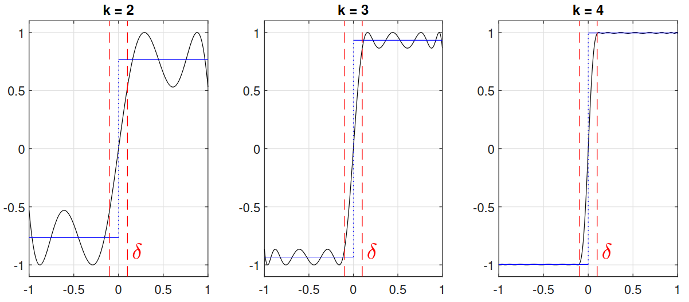

# Composite Polynomial Approximations to the Sign and Sqrt Functions

**Author:** Mike Fuller

**Last Updated:** 29th July 2025

This repository contains the figures and report for my master's disseration, *Composite Polynomial Approximations to the Sign and Sqrt Functions*, at the University of Oxford. All code snippets used to make the figures were written in $\text{MATLAB}$ and leveraged the [`chebfun`](https://www.chebfun.org/) package, allowing easy visualisation of polynomial approximants, their error functions, and their equioscillation points.

Composing low-degree polynomials or rational functions is an effective way of rapidly producing such functions of much higher degree, and a remarkable result in rational approximation theory states that appropriately composing Zolotarev functions (best rational approximants) generates higher-order Zolotarev functions. This dissertation investigates the polynomial analogue by constructing a composite polynomial approximation to the Sign and Sqrt functions based on a greedy algorithm. Thanks to the composition approach, we observe exponential convergence with respect to the degrees of freedom. As such, these approximations have wide applications in scientific computing, in particular to improve the computation time of high-dimensional matrix functions.

- [Figures (mostly in EPS format)](https://github.com/itsmikefuller/composite_polynomial_approximations/tree/main/figures)
- [Final PDF Report](https://github.com/itsmikefuller/composite_polynomial_approximations/blob/main/report.pdf)
